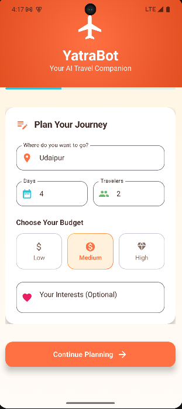
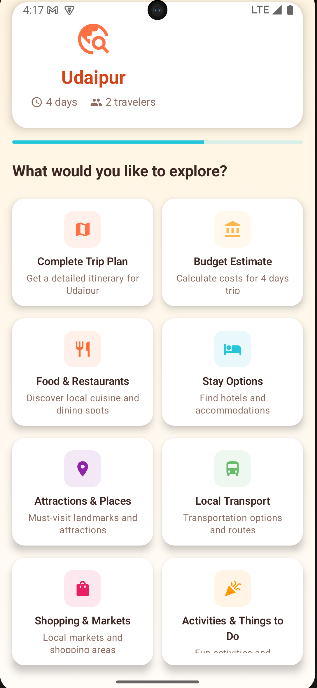
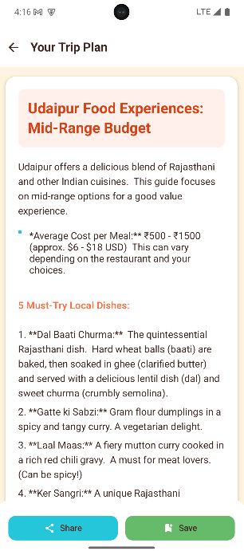
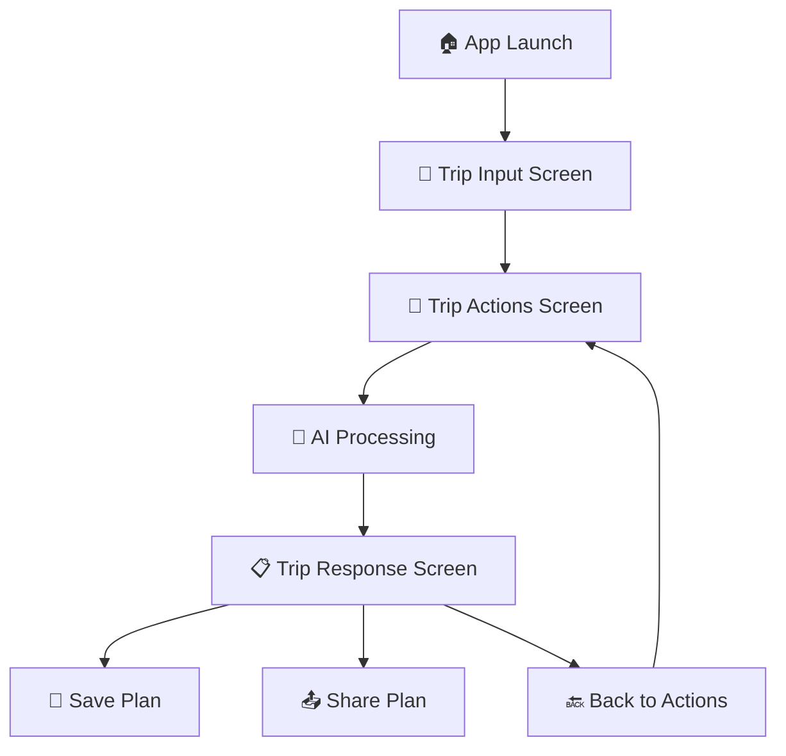

# 🇮🇳 YatraBot - Your Indian Travel AI Companion

<div align="center">
  
  
  
  
</div>

<div align="center">
  <h3>🌟 Discover India with AI-Powered Travel Planning 🌟</h3>
  <p>An intelligent travel companion that creates personalized itineraries for incredible Indian destinations like Goa, Rajasthan, Kerala, and beyond!</p>
</div>

---

## 📱 About YatraBot

**YatraBot** is a modern, production-ready Android application that leverages the power of artificial intelligence to create personalized travel experiences across India. Whether you're planning a beach vacation in Goa, exploring the royal heritage of Rajasthan, or seeking adventure in the Himalayas, YatraBot crafts detailed itineraries tailored to your preferences, budget, and travel style.

### 🎯 Core Features

- **🤖 AI-Powered Planning**: Get intelligent, personalized travel recommendations
- **🏖️ Indian Destinations**: Specialized knowledge of popular Indian tourist spots
- **💰 Budget-Friendly**: Plans for low, medium, and high budgets
- **🍽️ Local Cuisine**: Discover authentic local food and restaurants
- **🚗 Transport Guide**: Local transportation options and tips
- **🏛️ Attractions**: Must-visit places and hidden gems
- **🛍️ Shopping**: Local markets and shopping recommendations
- **💾 Save & Share**: Save your plans and share with friends

---

## 📸 Screenshots

| MainScreen | features                                           | Responses                                                                               
|--------|-------------------------------------------------|----------------------------------------------------
|  |  |  


---

## 🚀 Features Overview

### 🎨 **Modern UI/UX**
- ✨ **Jetpack Compose** - Latest Android UI toolkit
- 🎭 **Material Design 3** - Beautiful, intuitive interface
- 🌈 **Indian-Inspired Colors** - Saffron, turquoise, and warm earth tones
- 📱 **Mobile-First Design** - Optimized for Android devices
- 🔄 **Smooth Animations** - Engaging user experience

### 🧠 **AI Intelligence**
- 🤖 **OpenAI/Gemini Integration** - Powered by cutting-edge AI
- 📝 **Personalized Itineraries** - Tailored to your preferences
- 💡 **Smart Recommendations** - Context-aware suggestions
- 🎯 **Multi-Service Support** - Complete travel planning ecosystem

### 🛠️ **Technical Excellence**
- 🏗️ **MVVM Architecture** - Clean, maintainable code structure
- ⚡ **Kotlin Coroutines** - Asynchronous programming
- 🌐 **Retrofit + OkHttp** - Robust network communication
- 💾 **State Management** - Efficient UI state handling
- 🔒 **Error Handling** - Graceful error management

---

## 🛠️ Tech Stack

| Category | Technology |
|----------|-------------|
| **Language** |  |
| **UI Framework** |  |
| **Architecture** | MVVM (Model-View-ViewModel) |
| **Networking** | Retrofit, OkHttp |
| **Async Programming** | Coroutines, Flow |
| **AI Service** | OpenAI GPT / Google Gemini |
| **UI Components** | Material Design 3 |
| **Build System** | Gradle (Kotlin DSL) |

---

## 📱 App Flow



### 📋 Screen Details

1. **🏠 TripInputScreen**
   - Destination selection
   - Trip duration (days)
   - Number of travelers
   - Budget preference (Low/Medium/High)
   - Interests and preferences

2. **🎯 TripActionScreen**
   - Complete Trip Plan
   - Budget Estimation
   - Food & Restaurants
   - Stay Options
   - Local Transport
   - Attractions & Places
   - Shopping & Markets
   - Activities & Things to Do

3. **📋 TripResponseScreen**
   - AI-generated formatted response
   - Markdown-style formatting
   - Save functionality
   - Share functionality
   - Back navigation

---

## 🚀 Getting Started

### Prerequisites

- **Android Studio** (Latest stable version)
- **JDK 11** or higher
- **Android SDK** (API level 24+)
- **Git** for version control

### Installation

1. **Clone the repository**
   ```bash
   git clone https://github.com/anshjn1411/yatrisetu.git
   ```

2. **Open in Android Studio**
   - Launch Android Studio
   - Select "Open an existing project"
   - Navigate to the cloned directory

3. **Configure API Keys**
   ```kotlin
   // In local.properties or BuildConfig
   OPENAI_API_KEY="your_openai_api_key_here"
   // OR
   GEMINI_API_KEY="your_gemini_api_key_here"
   ```

4. **Sync Project**
   - Click "Sync Now" when prompted
   - Wait for Gradle sync to complete

5. **Run the App**
   - Connect an Android device or start an emulator
   - Click the "Run" button (▶️) in Android Studio

### 🔑 API Setup

#### OpenAI Setup
1. Visit [OpenAI Platform](https://platform.openai.com/)
2. Create an account and generate an API key
3. Add the key to your `local.properties` file

#### Gemini Setup
1. Visit [Google AI Studio](https://makersuite.google.com/)
2. Create a project and generate an API key
3. Add the key to your `local.properties` file

---

## 🔧 Configuration

### Build Variants
- **Debug**: Development build with logging
- **Release**: Production build with proguard

### Minimum Requirements
- **Android 7.0** (API level 24)
- **4GB RAM** recommended
- **Internet connection** required

---


## 🙏 Acknowledgments

- **OpenAI** for providing excellent AI capabilities
- **Google** for Jetpack Compose and Material Design
- **JetBrains** for the amazing Kotlin language
- **Indian Tourism** for inspiration and cultural insights
- **Open Source Community** for continuous support

---

<div align="center">
  <h3>🌟 Star this repository if you found it helpful! 🌟</h3>
  <p>Made with ❤️ in India 🇮🇳</p>
  
  <a href="https://github.com/yourusername/yatrabot">
    
  </a>
  <a href="https://github.com/yourusername/yatrabot/fork">
    
  </a>
  <a href="https://github.com/yourusername/yatrabot/watchers">
    
  </a>
</div>

---

**Happy Traveling! 🧳✈️**


